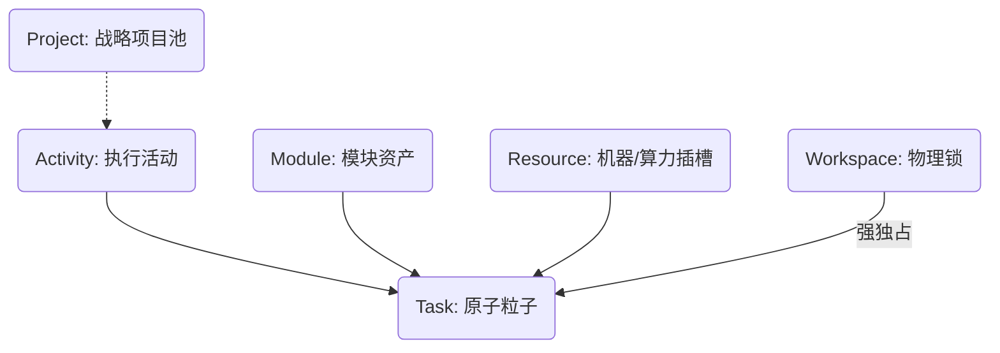

# Smart Task Hub (STH) - Structured Task Management Server

> 一个面向 LLM 协作而设计的、结构化的任务管理中枢。

## 🌟 设计初衷 (Design Mindset)

在复杂的项目协作中，任务往往在不同维度间跳跃：从用户的原始需求 (Project)，到业务层的执行活动 (Activity)，再到底层代码资产 (Module) 的修改，以及人力资源 (Resource) 的分配。

**Smart Task Hub** 的核心设计思路是**“分层治理与降维计算”**，在结构上天然为 **Multi-Agent System (多智能体系统)** 的协作流程做了最优适配。它将系统拆解为五个核心维度，形成严密的流转网络：

1. **Project (战略项目池 - The Inbox)**: 管理宽泛、非结构化的意图边界，捕获最初的外部需求。
2. **Activity (执行活动 - The Strategy/Path)**: 交付价值的执行路径。拆解真实的业务属性，定义总体预期收益与终局时间线。
3. **Module (物理实体 - The Entity)**: 系统知识图谱中的最小物理节点。建议将其细分为足够颗粒度的组件 (Component Tree)，使得落入其中的变动天然带有“影响边界锁”。
4. **Resource (物理资产/算力 - The Agent Slot)**: 执行的主体，指代具体的物理机器、算力容器或 Agent 实例。它决定了并发执行的硬上限。
5. **Workspace (物理阵地 - The Sandbox)**: 任务执行的物理路径（如特定的 Git 仓库目录）。这是系统中唯一的**强独占资源**。同一路径在同一时间只能被一个任务占用，确保多 Agent 协作时不会在同一个文件系统内产生物理冲突。
6. **Task (原子粒子 - The Delta Vector)**: 每一个 Task 仅对应一个 Module 与一个 Activity。它是状态变化的原子单位。
    * **语义矢量 (`module_iteration_goal`)**: 采用自然语言陈列要在目标 Module 细粒度上发生的迭代增量与影响。
    * **结构化依赖推导 (`depends_on`)**: 将“排期仲裁权”交给基于自然语言的语义分析。方案分析代理（Architect Agent）通过比对各任务的 `module_iteration_goal`，推演时序逻辑冲突，并将其固化为严格的有向无环图结构，输出至 `depends_on` 字段，完成降维。

---

## 🏗️ 架构概览 (Architecture)

### 1. 数据模型 (Data Model)

本项目采用了 PostgreSQL 作为持久化层，其核心表结构设计遵循以下逻辑：



*   **唯一 ID 体系**: 采用 `PRE-YYYYMMDD-XXXX` 格式。
*   **双参校验模式**: 接口采用 `xxx_id` + `xxx_id_name` 的双参数模式（例如 `resource_id` 和 `resource_id_name`）。大模型在调用工具时需同时填写，以便人类在审计界面一眼看出 ID 对应的具体内容，确保操作的准确性。
*   **解耦溯源模型**: Task 强映射 Activity，Activity **弱依赖** Project。内部存储完全 ID 化，外部交互通过冗余的名字参数实现人类友好型校验。

### 2. 边界哲学: 结构化算力 vs 非结构化智能 (Structure vs Semantics)

在系统底座的字段设计上，我们坚守一条架构铁律：**“把确定性交给算力，把不确定性交给智能”**（即用结构化的缸，盛放非结构化的水）。

*   **强结构化防呆 (The Structured Bones)**：
    *   代表字段：`parent_module_id` (外键)、`depends_on` (原生 PostgreSQL 数组)。
    *   设计主张：凡是涉及**流程控制 (Control Flow)**、**空间拓扑 (Spatial Topology)** 和**数学排期运算 (Graph Math)** 的节点链接，必须使用最死板的数据库约束锁死。例如排期引擎（Scheduler Engine）必须依赖规整的 `depends_on` 拓扑排序算法运转，并在分发前通过 `ResourceManager` 锁定目标的物理主场 (Workspace)。
*   **非结构化扩展 (The Semantic Flesh)**：
    *   代表字段：`layer_type` (模块层级刻度, `VARCHAR`)、`module_iteration_goal` (模块增量逻辑, `TEXT`)。
    *   设计主张：凡是涉及**业务意图 (Business Intention)**、**实体规模定性 (Scale Categorization)** 和**执行上下文 (Cognitive Context)** 的节点，必须交由 LLM 动态推演，拒绝通过 `Enum` 锁死演进路径。例如，一个 Module 可以在 AI 视角下从 `L2-Service`（微服务）自然泛化为 `L1-Domain`（国家/公司实体），而无需修改任何底层 Schema。

### 3. 技术栈 (Technology Stack)

*   **FastAPI & FastMCP**: 利用 [Model Context Protocol (MCP)](https://modelcontextprotocol.io/)，使该服务器能够无缝对接 AI 智能体（如 Claude, GPT-4），使其具备读写任务数据的能力。
*   **psycopg3**: 异步驱动确保在高并发下依然能保持响应。
*   **Docker & Docker Compose**: 一键部署，环境隔离。

---

## 🛠️ 核心功能工具 (MCP Tools)

本服务器向 LLM 暴露了多维度的工具集：

| 分类 | 工具示例 | 说明 |
| :--- | :--- | :--- |
| **基础 CRUD** | `upsert_project`, `upsert_task`, etc. | 核心实体生命周期管理，支持双参校验。 |
| **观测与审计** | `get_task_logs`, `get_activity_schedule_report` | 实时的 Agent 思路追踪与活动进度可视化 Markdown 报告。 |
| **人机熔断** | `list_tasks_for_review`, `approve_task`, `reject_task` | 核心治理工具，实现对 Agent 计划的人工审核。 |
| **数据库驱动** | `query_sql`, `get_database_schema` | 允许 AI 动态感知 Schema 并进行跨维度数据分析。 |

---

## 📦 安装与部署 (Installation)

### 1. 作为 Claude Skill 安装 [NEW]
如果你使用支持 GitHub 安装的 Claude 客户端（如 `claudebank` 或手动配置），可以直接安装此工程作为增强能力：

```bash
# 使用 claudebank (示例)
claudebank install https://github.com/your-repo/smart_task
```

**手动安装：**
将本仓库的 `skills/smart_task_management/` 目录拷贝至你的 Claude Skill 路径：
*   **Windows**: `%USERPROFILE%\.claude\skills\`
*   **macOS/Linux**: `~/.claude/skills/`

### 2. 本地服务环境配置
在根目录下创建 `.env` 文件：
```env
DB_HOST=localhost
DB_PORT=5432
DB_USER=postgres
DB_PASSWORD=yourpassword
DB_NAME=smart_task
PORT=8000
```

### 3. 使用 Docker 部署 Hub
```bash
docker-compose up -d --build
```

---

## 💡 使用场景示例

1.  **需求捕获（Project）**: 用户非结构化输入“我想在页面加个搜索功能”，由服务栈生成 `upsert_project` 记录。
2.  **业务策略层 (Activity)**: 读取 Project 生成对口 `Activity`，定义业务/执行目标、限定 Owner 与边界。
3.  **结构化降维 (Architect)**: 方案结构拆解 AI 读取 Activity 意图与对口的细粒度 Module，下推生成多个原子级 `Task`。它基于阅读各任务的自然语义生成有向无环图结构 `depends_on`，任务初始状态为 `pending`。
4.  **人机熔断与预审批 (Review & Sign-off) [NEW]**: 
    *   人类通过 `list_tasks_for_review` 审阅 Agent 自动拆解的路线图与成本预估。
    *   **预审批**: 哪怕依赖项未完成，人类也可调用 `approve_task` 预签发权限。
    *   **拦截**: 未经过审批且依赖已满足的任务，将自动停留在 `awaiting_approval`。
5.  **数学排期引擎 (Scheduler Engine / Agent)**: 自动挑选 `status = 'ready'` 且 `is_approved = TRUE` 的任务。配合 `ResourceManager` 的物理资源与 Workspace 锁，发起执行。

---

## 🛡️ 治理与观测性 (Governance & Observability)

### 1. 行为审计 (Audit Trail)
本项目集成了 **ADK Event Tracking** 机制。Agent 的每一轮思考 (`thought`) 和工具调用 (`tool_call`) 都会作为 `Event` 实时持久化至 PostgreSQL。通过 `get_task_logs` 工具，人类可以像查看控制台日志一样查看 Agent 的“心理轨迹”。

### 2. 人机熔断机制 (Human-in-the-Loop)
为了防止 Agent 陷入死循环、产生逻辑偏移或消耗非预期资源，系统在任务分发层设立了强制熔断器。
*   **资源保护**: 只有 `is_approved` 标记为 `TRUE` 的任务才会被派发。
*   **状态隔离**: 新引入 `awaiting_approval` 状态，将任务的“逻辑就绪”与“派发授权”解耦。

---

## 📂 目录结构 (Directory Structure)

* `smart_task_hub/`: 核心调度中枢 (Control Plane)，负责任务状态流转与事件分发。
* `skills/`: Claude Skill 定义目录，包含 `SKILL.md` 指令集。
* `dashboard/`: 任务可视化监控面板 (React)。
* `docs/`: 详细设计文档与 API 说明。
* `docker-compose.yml`: 一键化容器编排配置。

---

## 🛠️ 开发与测试

本项目采用 TDD 驱动重构。

```bash
# 运行所有测试
uv run pytest
```
