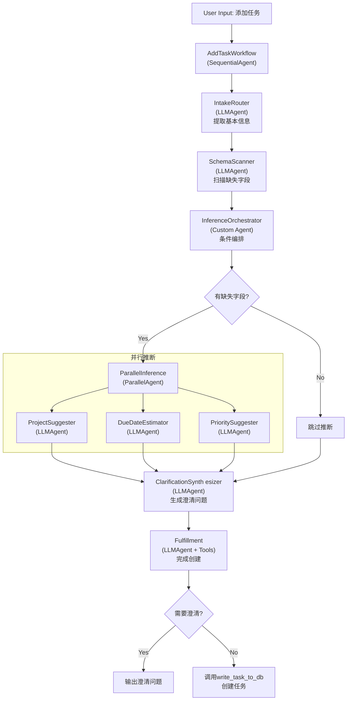

# AddTask工作流架构 (重构后 - LLMAgent架构)

## 概述

基于ADK最佳实践,使用**LLMAgent配置化**+ **Workflow Agent编排**实现任务添加流程。

## 架构图



## 核心设计原则

### 1. LLMAgent优先
- 使用`LlmAgent`的`instruction`、`output_schema`和`output_key`
- 避免手动继承`BaseAgent`(除非真正需要自定义逻辑)

### 2. 自动状态管理
- 每个Agent通过`output_key`自动保存结果到`session.state`
- 下游Agent通过`instruction`中的占位符引用上游结果,如`{basic_info}`

### 3. 层级编排
- 使用`SequentialAgent`串行执行
- 使用`ParallelAgent`并行执行
- 使用Custom Agent仅在需要条件逻辑时

## Agent详细设计

### IntakeRouter (LLMAgent)
**输出**: `session.state["basic_info"]`

### SchemaScanner (LLMAgent)
**输入**: `{basic_info}`  
**输出**: `session.state["scan_result"]`

### InferenceOrchestrator (Custom Agent)
**职责**: 条件执行并行推断
- 检查`{scan_result}.all_fields_present`
- 如果有缺失字段,运行`ParallelInference`
- 如果字段齐全,跳过

### ProjectSuggester / DueDateEstimator / PrioritySuggester (LLMAgent)
**输入**: `{basic_info}`, `{scan_result}`  
**输出**: 各自的suggestion到session.state

### ClarificationSynthesizer (LLMAgent)
**输入**: 所有上游结果  
**输出**: `session.state["clarification"]`

### Fulfillment (LLMAgent + Tools)
**输入**: `{clarification}`  
**工具**: `write_task_to_db(task_data: dict) -> str`  
**输出**: `session.state["fulfillment_result"]`

## 数据流转

```
user_input (initial)
  ↓
basic_info (IntakeRouter output_key)
  ↓
scan_result (SchemaScanner output_key)
  ↓ (条件分支)
project_suggestion, due_date_suggestion, priority_suggestion (并行输出)
  ↓
clarification (ClarificationSynthesizer output_key)
  ↓
fulfillment_result (Fulfillment output_key)
```

所有数据自动通过`session.state`传递,ADK框架自动注入到`instruction`的占位符中。

## 与旧架构对比

### 旧架构问题
❌ 手动继承`BaseAgent`实现业务逻辑  
❌ 手动操作`ctx.session.state["task_state"]`  
❌ 需要自己定义`TaskState`类管理状态  
❌ 扁平的序列结构,缺少层级

### 新架构优势
✅ 使用`LlmAgent`配置化实现  
✅ 通过`output_key`自动管理状态  
✅ 无需手动状态类,使用Pydantic schema  
✅ 清晰的层级结构(Sequential/Parallel)  
✅ Custom Agent仅用于真正需要的条件逻辑

## 参考文档

- [ADK LLM Agents](https://google.github.io/adk-docs/agents/llm-agents/)
- [Multi-Agent Systems](https://google.github.io/adk-docs/agents/multi-agents/)
- [Workflow Agents](https://google.github.io/adk-docs/agents/workflow-agents/)
