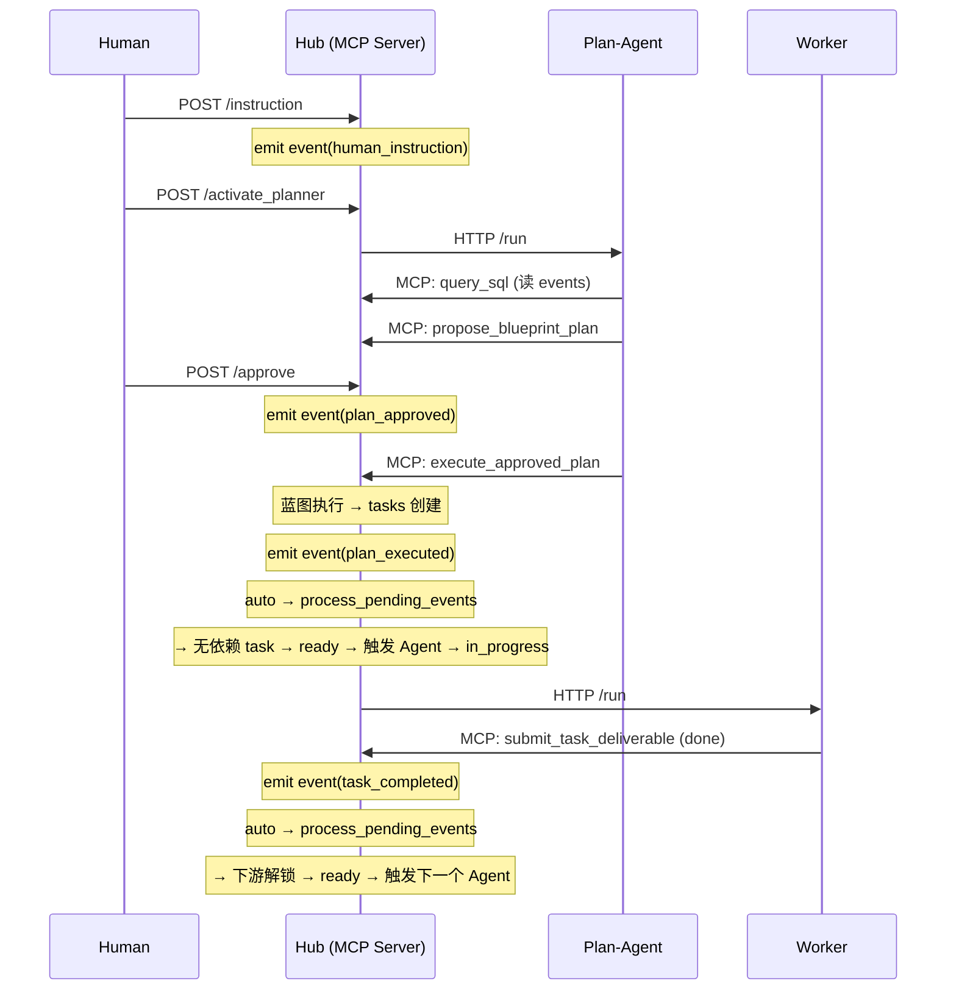
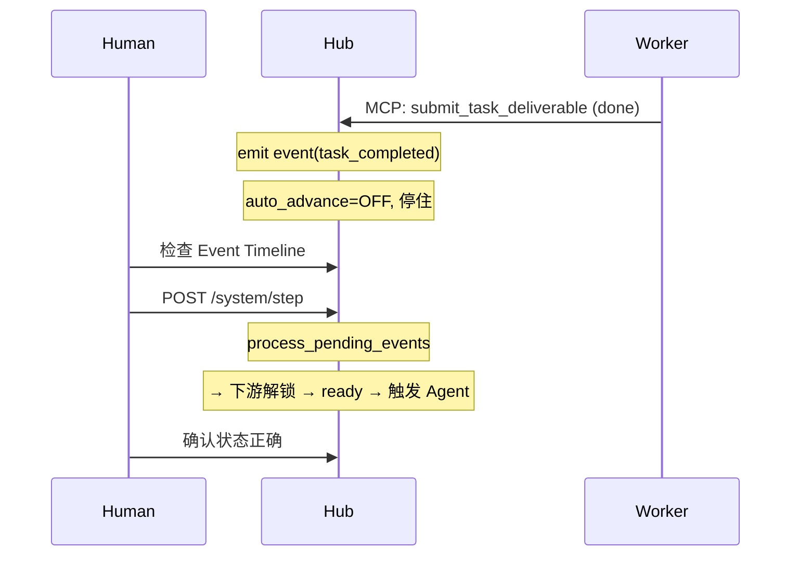

# Smart Task Hub — 架构设计文档

> 本文档定义系统的架构模型、各模块权责边界、驱动方式与信息可见范围。
> 后半部分包含各模块的当前状态 vs 目标状态的实施对照表。

---

## 一、核心模型：事件驱动的三层架构

### 1.1 一句话概括

> **Event Bus 是系统唯一的协调中心。Engine 和 Plan-Agent 都消费 Event Bus，但方式不同：Engine 做确定性反应，Plan-Agent 做智能分析。Human 负责整体监控与决策。**

### 1.2 三个角色

| 角色 | 定位 | 驱动方式 | 对 Event Bus 的关系 |
|---|---|---|---|
| **Engine** | 物理层 — 系统的"自然定律" | 事件触发（自动）或人类触发（手动） | **反应式消费**：处理事件 → 产生新事件 |
| **Plan-Agent** | 策略层 — 系统的"大脑" | 被唤醒时执行 | **分析式读取**：读取事件 → 理解态势 → 调整计划 |
| **Human** | 监控与决策层 — 全局掌控 | 主动操作 | **监控**态势 + **审批**方案 + **下达**指令 + **调度** Agent |

### 1.3 判断标准

> 一个操作该由谁来做？

- **不需要思考** → Engine（DAG 推进、资源回收、Agent 触发）
- **需要判断力** → Plan-Agent（任务失败后重试还是换方案？新需求如何拆分？）
- **需要权限或全局视野** → Human（审批方案、下达需求、监控进度、决定何时介入）

---

## 二、Event Bus：统一协调中心

### 2.1 Event Bus 的两个角色

**角色 1：Agent 的项目级上下文构建机制**

Plan-Agent 被唤醒后，通过读取 Event Bus 来理解"自上次检查以来，项目发生了哪些变化"。
这类似于 Git log——你不需要手动写变更记录，每次 commit 本身就是记录。
Hub 自动将所有状态变化写入事件总线，确保 Agent 获得的上下文完整且不遗漏。

**角色 2：Engine 的事件处理队列**

Engine 通过处理 pending 事件来执行确定性的状态转换。
例如：看到 `task_completed` 事件 → 检查 DAG 依赖 → 提升下游任务 → 触发 Agent → 写入新事件。

### 2.2 Engine 和 Plan-Agent 的消费方式对比

```
                    EVENT BUS (events 表)
                 ┌────────────────────────┐
                 │ task_completed          │
                 │ task_failed             │
                 │ task_ready              │
                 │ task_assigned           │
                 │ human_instruction       │
                 │ plan_approved           │
                 │ plan_executed           │
                 │ ...                     │
                 └───┬───────────────┬─────┘
                     │               │
              ┌──────▼──────┐  ┌─────▼──────┐
              │   Engine    │  │ Plan-Agent  │
              │  (物理层)    │  │  (策略层)   │
              │             │  │             │
              │ 确定性反应:   │  │ 智能分析:   │
              │ task_completed│ │ task_failed │
              │ → 推进 DAG   │  │ → 重试？换路？│
              │ → 触发 agent │  │ → 调整计划？ │
              │             │  │             │
              │ 消费事件     │  │ 读取事件     │
              │ (标记 resolved)│ │ (记录水位线)  │
              └─────────────┘  └─────────────┘
              事件驱动(始终)     人类唤醒
```

**事件的生命周期**：

| 阶段 | status | 说明 |
|---|---|---|
| 产生 | `pending` | MCP 工具或 Engine 写入 |
| Engine 处理 | `resolved` | Engine 执行了确定性反应（DAG 推进等） |
| Plan-Agent 已阅 | `resolved` | Plan-Agent 不改 status，而是记录**已阅水位线**（`last_seen_event_id`） |

**Plan-Agent 的已阅水位线**：
- 由 Agent 自身管理（通过 ADK session 记录 `last_seen_event_id`），不存储在 Hub 中
- Agent 每次被唤醒时：`SELECT * FROM events WHERE id > {last_seen_id} ORDER BY id`
- 处理完后在自己的 session 中更新水位线。Hub 不感知 Agent 的阅读进度

**关键区别**：

| | Engine | Plan-Agent |
|---|---|---|
| 触发方式 | 事件驱动（有 pending 事件就处理） | 人类唤醒 |
| 处理时机 | 即时（auto）或延迟到人类点 Step（manual） | 人类决定 |
| 对事件的操作 | 消费（处理后标记为 resolved） | 读取（记录水位线，不消费） |
| 产出 | 新事件（task_ready, task_assigned） | 蓝图方案（blueprint_plan） |
| 需要思考吗 | 不需要，纯规则 | 需要，用 LLM 推理 |

### 2.3 事件处理时机：闸门（Valve）逻辑

Engine 的运作遵循**“阀门控制”**原理。外部输入（MCP 工具）产生事件后，系统根据 `auto_advance` 决定是否放行：

*   **闸门开启 (Auto)**：
    每当 MCP 工具 `emit_event` 后，会**立即同步触发** Engine 的 `run_to_stable()`。Engine 会像冲刷（Flush）一样，持续处理所有因果链条，直到系统再次进入无 pending 事件的稳定态。
*   **闸门关闭 (Manual)**：
    MCP 工具仅 `emit_event` 随后立即返回。事件堆积在 Bus 中处于 `pending` 状态。Engine 保持静默，直到人类通过 Dashboard 发送 `step` 指令“手动放行”一条或一批事件。

> **核心设计点**：
> 1. **Engine 是被动的**：它没有后台线程，必须由“外部输入”或“人类指令”来驱动执行。
> 2. **Auto 模式的本质**：是将“触发引擎”这一动作委托给了每一个产生事件的工具。

### 2.4 信号 (Events) vs. 执行 (Tasks)

必须严格区分**“状态切换的信号”**与**“任务执行的过程”**：

| 维度 | 信号 (Signals / Events) | 执行 (Execution / Tasks) |
|---|---|---|
| **性质** | 瞬时的状态跳变（火花） | 持续的物理过程 |
| **责任方** | **Engine** | **外部 Agent / Worker** |
| **Engine 状态** | **活跃**：正在进行 `run_to_stable` 冲刷 | **静默**：处于 Stable 态，等待下一个信号 |
| **例子** | `task_ready`, `task_assigned` | 编写代码、运行测试、写文档 |

**逻辑闭环**：
1. 外部信号（如任务完成）打破 Stable 态 → Engine 唤醒。
2. Engine 产生一系列内部信号（如解锁下游任务）并执行。
3. Engine 发出最后一个指令信号（指派 Agent），然后立即将该事件标记为 `resolved`。
4. **系统重新进入 Stable 态**。此时 Agent 正在后台“埋头苦干”，Engine 不再消耗任何资源。

---

## 三、各模块权责定义

### 3.0 模块依赖关系

```
┌─ server.py ─────────────────────────────────── 组装 ──┐
│                                                       │
│  ┌─ mcp_app.py ──┐  ┌─ dashboard_api.py ─┐           │
│  │  MCP 入口      │  │  REST 入口 (人类)   │           │
│  └───────┬───────┘  └────────┬────────────┘           │
│          │                   │                         │
│  ┌───────▼───────────────────▼────────────┐           │
│  │           tools.py (MCP 工具层)         │           │
│  │  Agent 和人类的统一数据接口              │           │
│  │  纯 CRUD + 委托 engine 产生副作用       │           │
│  └───────────────────┬────────────────────┘           │
│                      │                                 │
│  ┌───────────────────▼────────────────────┐           │
│  │          engine.py (确定性引擎)         │           │
│  │  事件处理 + DAG 推进 + 资源回收          │           │
│  │  + Agent 触发（通过 supervisor）        │           │
│  └───────────────────┬────────────────────┘           │
│                      │                                 │
│  ┌──────┴──────┐  ┌──┴───────────┐                    │
│  │   db.py     │  │ supervisor.py│                    │
│  │ SQL 读写    │  │ Agent 进程管理│                    │
│  └─────────────┘  └──────────────┘                    │
└───────────────────────────────────────────────────────┘
```

### 3.1 `db.py` — 数据库原语

| 维度 | 说明 |
|---|---|
| **职责** | 提供 SQL 读写原语。无业务逻辑 |
| **依赖** | psycopg2 |
| **被谁调用** | 所有其他模块 |
| **信息可见范围** | 全部数据库表 |

### 3.2 `supervisor.py` — Agent 进程管理

| 维度 | 说明 |
|---|---|
| **职责** | 管理 Worker Agent 进程生命周期。提供 Agent URL 查找。不做任何业务决策 |
| **依赖** | config.yaml, subprocess, httpx |
| **被谁调用** | `engine.py`（触发 Agent）, `server.py`（bootstrap）, `dashboard_api.py`（唤醒 Planner） |
| **信息可见范围** | config.yaml 中的 agent 池配置 + 进程状态 |

### 3.3 `engine.py`（现 `scheduler.py`，将改名）— 确定性引擎

| 维度 | 说明 |
|---|---|
| **职责** | 执行所有不需要思考的状态机操作。处理 pending 事件 → 确定性状态转换 → 产生新事件 |
| **依赖** | `db.py`（SQL）, `supervisor.py`（Agent URL + HTTP 触发） |
| **被谁调用** | `tools.py`（MCP 工具副作用）, `dashboard_api.py`（手动 Step） |
| **信息可见范围** | events 表（pending 事件）, tasks 表（状态 + 依赖）, modules 表（owner_res_id）, resources 表 |
| **驱动方式** | auto 模式 → 被 tools.py 同步调用；manual 模式 → 被 dashboard_api 手动调用 |

核心函数：

| 函数 | 作用 |
|---|---|
| `emit_event(...)` | 向 events 表写入一条记录 |
| `step()` → dict | **物理步进**：处理最早的一条 pending 事件。若产生次生事件，则留在队列中等待下一次 Step。 |
| `run_to_stable()` → list | **因果冲刷**：在 Auto 模式下调用。循环执行 `step()` 直到队列清空。 |
| `get_auto_advance()` / `set_auto_advance()` | 读写 `runtime_settings.json` |

> **Engine 的原子操作 (`step`)**：
> 1. 读取 `id` 最小的 `pending` 事件。
> 2. 根据 `event_type` 执行对应逻辑（资源回收、DAG 推进、Agent 触发等）。
> 3. 产生任何次生后果（如 `task_ready`）时，通过 `emit_event` 写入 Bus。
> 4. 标记当前事件为 `resolved`。

### 3.4 `tools.py` — MCP 工具层

| 维度 | 说明 |
|---|---|
| **职责** | Agent 和系统交互的统一接口。纯 CRUD + 委托 engine 产生副作用 |
| **依赖** | `db.py`, `engine.py` |
| **被谁调用** | Agent（通过 MCP 协议） |
| **信息可见范围** | 通过 `query_sql` 可见所有数据 |
| **驱动方式** | 被 Agent MCP 调用 |

关键副作用：

| 工具 | 副作用 |
|---|---|
| `submit_task_deliverable` | emit event → (if auto_advance) process_pending_events |
| `execute_approved_plan` | 执行蓝图 → emit event → (if auto_advance) process_pending_events |
| 其他所有工具 | 无副作用，纯 CRUD |

### 3.5 `dashboard_api.py` — 人类 REST 接口

| 维度 | 说明 |
|---|---|
| **职责** | 人类通过 Dashboard 与系统交互。包含唤醒 Agent 的逻辑（因为这是人类决策） |
| **依赖** | `db.py`, `engine.py`（Step + settings）, `supervisor.py`（Planner URL） |
| **被谁调用** | Dashboard 前端 |
| **信息可见范围** | activities, tasks, events, blueprints, system settings |
| **驱动方式** | 人类 HTTP 请求 |

### 3.6 `server.py` — 应用入口

纯组装。无业务逻辑，不启动后台业务线程。

### 3.7 `mcp_app.py` — MCP 单例

提供 `mcp = FastMCP("Smart Task Hub")` 单例。无业务逻辑。

---

## 四、各模块实施变更

### 模块 A: `engine.py`（现 `scheduler.py`，改名）

**当前内容（全部删除）**：

| 函数 | 行号 | 处置 |
|---|---|---|
| `dispatch_tasks()` | 18-49 | ❌ 删除 |
| `_send_agent_request()` | 51-64 | ❌ 删除（Agent HTTP 触发逻辑移入 engine 的 process_pending_events） |
| `_trigger_agent_async()` | 66-68 | ❌ 删除 |
| `trigger_planner_async()` | 70-72 | ❌ 删除（移至 dashboard_api.py） |

**目标内容（全部新写）**：

| 函数 | 作用 |
|---|---|
| `emit_event(type, source, severity, activity_id, task_id, payload)` | 向 events 表写入一条记录 |
| `process_pending_events()` → dict | 处理所有 pending 事件，执行完整推进周期 |
| `get_auto_advance()` → bool | 从 `runtime_settings.json` 读取开关 |
| `set_auto_advance(value: bool)` | 写入开关 |

---

### 模块 B: `tools.py`

| 工具 | 当前行为 | 目标行为 |
|---|---|---|
| `submit_task_deliverable` | 仅更新 task 状态 + 标记 assignment completed | 更新状态 + **emit event** + (if auto_advance) **process_pending_events** |
| `execute_approved_plan` | 执行蓝图修改 | 执行蓝图 + **emit event** + (if auto_advance) **process_pending_events** |
| `assign_task` | 仅更新 task 和 assignment | 不变（Planner 手动指派用。自动指派由 engine 的 process_pending_events 处理） |
| 其他工具 | — | 不变 |

---

### 模块 C: `dashboard_api.py`

| 方法 | 路径 | 变更 |
|---|---|---|
| POST | `/activity/{id}/activate_planner` | ⚠️ **改造** — Agent HTTP 逻辑直接内联 |
| POST | `/activity/{id}/instruction` | ⚠️ **改造** — 删除 system_state 写入 |
| POST | `/system/dispatch_tasks` | ❌ **删除** |
| POST | `/system/step` | ✅ **新增** — 手动触发 Engine 处理一轮 pending 事件 |
| POST | `/system/settings` | ✅ **新增** — 切换 auto_advance |
| GET | `/system/settings` | ✅ **新增** — 读取当前设置 |
| 其他端点 | | 不变 |

---

### 模块 D: `BlueprintGraph.jsx`

| 元素 | 当前 | 目标 |
|---|---|---|
| "Activate Planner" 按钮 | ✅ | ✅ 保留 |
| "Dispatch Tasks" 按钮 | ✅ | ❌ **删除** |
| auto_advance 开关 | — | ✅ **新增** |
| "Step" 按钮 | — | ✅ **新增**（手动模式时可用） |

---

## 五、完整数据流

### Auto 模式（生产）



### Manual 模式（调试）



---

## 六、实施清单

按依赖顺序执行：

### Phase 1: 引擎层（`scheduler.py` → `engine.py`）
- `[ ]` 改名 `scheduler.py` → `engine.py`
- `[ ]` 删除全部现有函数
- `[ ]` 新增 `emit_event()`
- `[ ]` 新增 `process_pending_events()`（DAG 推进 + Agent 触发 + 资源回收）
- `[ ]` 新增 `get_auto_advance()` / `set_auto_advance()`（读写 `runtime_settings.json`）

### Phase 2: MCP 工具层（`tools.py`）
- `[ ]` 改造 `submit_task_deliverable`: emit event + conditional process_pending_events
- `[ ]` 改造 `execute_approved_plan`: emit event + conditional process_pending_events
- `[ ]` 更新 import（scheduler → engine）

### Phase 3: API 层（`dashboard_api.py`）
- `[ ]` 删除 `POST /system/dispatch_tasks`
- `[ ]` 重构 `activate_planner`: Agent HTTP 逻辑内联
- `[ ]` 新增 `POST /system/step`
- `[ ]` 新增 `GET/POST /system/settings`
- `[ ]` 清理 `/instruction` 中的 `system_state` 写入
- `[ ]` 更新 import（scheduler → engine）

### Phase 4: 前端（`BlueprintGraph.jsx`）
- `[ ]` 删除 "Dispatch Tasks" 按钮和 `handleDispatchTasks`
- `[ ]` 新增 auto_advance 开关 (toggle)
- `[ ]` 新增 "Step" 按钮（调用 `/system/step`）
- `[ ]` 新增 `fetchSettings` 状态管理

### Phase 5: 构建 & 部署
- `[ ]` 创建 `runtime_settings.json`（默认 `{"auto_advance": false}`）
- `[ ]` 更新 `server.py` 中的 import
- `[ ]` `npm run build`
- `[ ]` `docker compose restart smart_task_hub`
- `[ ]` 验证 Dashboard 功能
