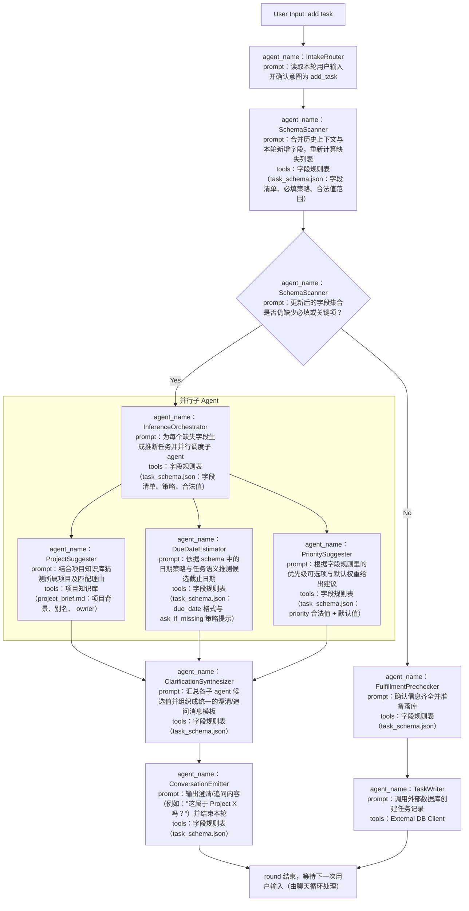

### Agent 中文说明

**agent_name：AddTaskAgent**  
prompt：解析 add task 指令，基于 task_schema.json 判断缺失字段，选择推断或追问策略，与用户进行最少打扰的澄清后，将完整任务提交到外部数据库。  
tools：
- 字段规则表（`memory-bank/task_schema.json`）：提供字段清单、合法值范围、必填/策略标记，驱动缺失检测与提示生成。
- 项目知识库（`memory-bank/project_brief.md`）：给出项目背景与别名，方便推断关联项目等上下文。
- 外部任务写入器（`External DB Client`）：负责将整理好的任务同步到 Notion 等外部数据库。

**子 Agent 角色速览**
- `InferenceOrchestrator`：根据缺失字段生成推断任务，并把它们广播给并行子 agent。
- `ProjectSuggester / DueDateEstimator / PrioritySuggester`：各自调用对应知识来源，输出字段候选值与置信度说明。
- `ClarificationSynthesizer`：负责汇总候选值、标记仍需追问的字段，并产出统一的对话提示。
